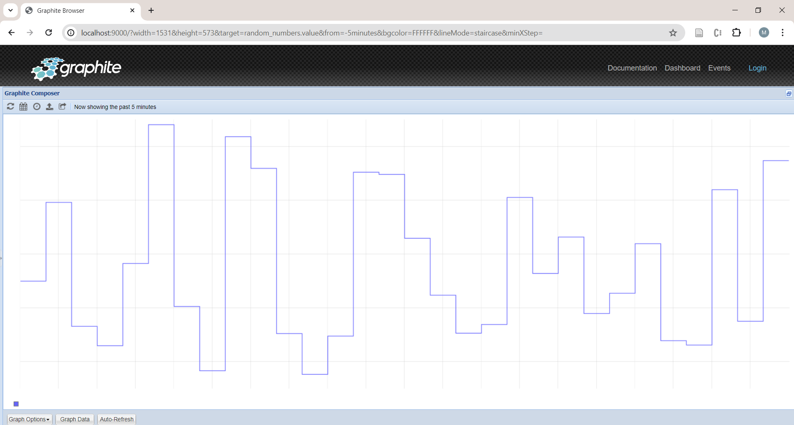

# Graphite


# Install Docker

Pull the official Docker container.

```
$ docker pull graphiteapp/graphite-statsd
```

# Run Docker Container


```
docker run -d \
    --rm \
    --name graphite \
    -v "$PWD/graphite/conf:/opt/graphite/conf" \
    -v "$PWD/graphite/storage:/opt/graphite/storage" \
    -p 2003-2004:2003-2004 \
    -p 2023-2024:2023-2024 \
    -p 9000:80 \
    graphiteapp/graphite-statsd
```

# Use Python to write data

```
$ python3 write_random.py
```

# View the data


