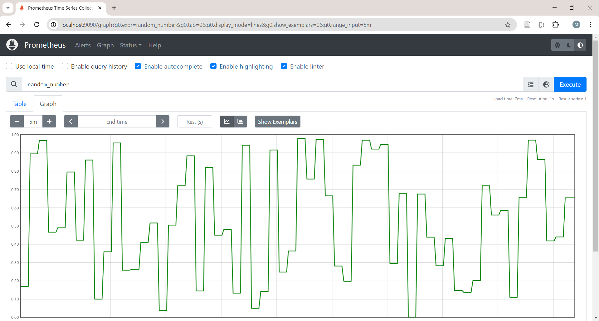

# Prometheus

```

```

Prometheus uses a push model to collect and store data. 
Rather than pushing data to Prometheus, you typically set up a metrics endpoint that Prometheus scrapes at regular intervals.

To simulate pushing random numbers to Prometheus, you need to expose an HTTP endpoint that Prometheus can scrape. The prometheus_client Python library can help you create this endpoint.


## Docker Installation

```
docker pull prom/prometheus
```

## Quick Start

1. Create a directory to make data persistent between container runs

```
$ mkdir data
```
 
2. Run Docker image


```
docker run -d \
    --rm \
    --net host \
    --name prometheus \
    -v "$PWD/prometheus.yaml:/etc/prometheus/prometheus.yml" \
    prom/prometheus
```

In the previous command, the Docker container is run on the host network so it can reach the HTTP server that will generate the data next.


## Using Python to Write Data

You can use Python to create data for Prometheus to scrape. Run the script for few minutes the stop it using `CTRL-C`.

```
$ python3 write_random.py
```

While the script is running open a browser and go to `localhost:9090'. Click on the `metric explorer` then search and select `random_number`. Click on execute to the graph.
 


